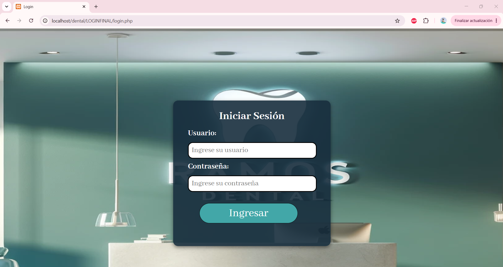
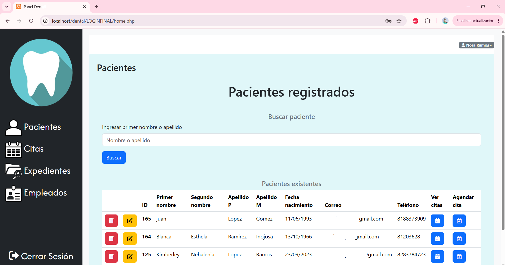

# Dental Ramos

> **A medical and administrative management system designed to optimize patient records, appointment scheduling, clinical files, and medical histories for Dental Ramos Clinic.**

This project was developed as a technological solution to replace manual record-keeping and paper-based documentation. Its goal is to reduce human errors, minimize the time spent searching for records, and centralize essential patient health information such as allergies, pre-existing conditions, blood pressure, and other relevant medical data.

<p align="center">
  
  
</p>

---

## Tech Stack

The system is built using a standard web-based architecture that enables efficient local deployment and execution:

- **Frontend / User Interface:** HTML5, CSS3, JavaScript (Modern native syntax).
- **Backend / Business Logic:** PHP (Version 7.4 or higher).
- **Database:** MySQL.
- **Local Server & Administration:** XAMPP and phpMyAdmin.
- **Development Environment:** Visual Studio Code.

---

## System Requirements

### Minimum Hardware Requirements

- **Processor:** Dual-core processor minimum (Intel i3, AMD Ryzen 3, or higher).
- **RAM:** At least 4 GB (8 GB recommended for smooth performance).
- **Storage:** 20 GB of available disk space (SSD recommended).
- **Display Resolution:** Minimum resolution of 1366 × 768 for comfortable use of the application.

### Supported Software

- Windows 10/11, macOS, or Linux distributions compatible with the XAMPP environment.

---

## Installation and Setup Guide

### 1. Local Server Setup (XAMPP)

1. Download **XAMPP** (PHP 7.4 or higher) from the official Apache Friends website.
2. Run the installer and install the standard components (`Apache`, `MySQL`, `phpMyAdmin`).
3. During the firewall configuration process, allow Apache server communication only on **private or home networks**.
4. Open the XAMPP Control Panel and start the **Apache** and **MySQL** services.

### 2. Visual Studio Code Configuration

To correctly link the PHP interpreter with Visual Studio Code:

1. Open VS Code Settings (`File -> Preferences -> Settings` or press `Ctrl + ,`).
2. Use the search bar to search for `php`.
3. Ensure that both `PHP › Validate: Enable` and `PHP › Validate: Run` are enabled (`onSave`).
4. Open or edit the `settings.json` file and add the path to the PHP executable installed on your machine:

```json
{
  "php.validate.executablePath": "C:\\xampp\\php\\php.exe"
}
```

### 3. Database Deployment

1. Open your browser and navigate to `http://localhost/phpmyadmin/`.
2. Create a database using the project name.
3. Import the provided `.sql` file to enable data storage and management.

---

## Database Structure

The database schema was designed following Third Normal Form (3NF) principles to minimize redundancy and maintain data consistency.

